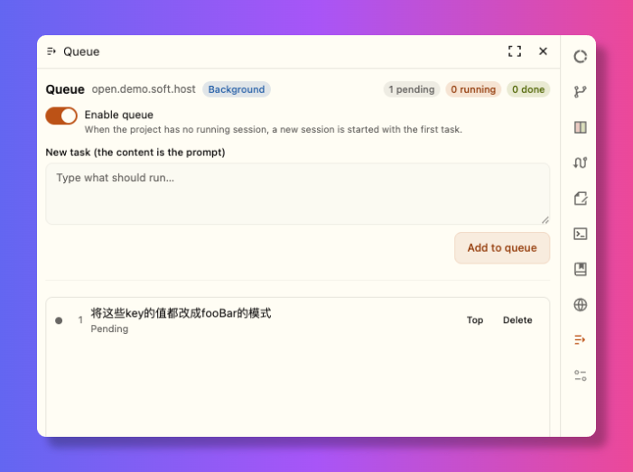

<div align="center">

# OpenChamber 队列

**给 [OpenChamber](https://openchamber.dev) 的按项目任务队列扩展。**
添加任务、打开开关，项目空闲满 10 秒后，下一个任务就会自动开始运行 —— 一次一个，无需逐个点击。

[English](./README.md) · 简体中文

[](./LICENSE)
[](https://openchamber.dev)
[](#语言)



</div>

任务只有一个字段：**内容**，也就是提示词。模型、agent 等使用项目自身的默认选择。该项目
**连续 10 秒没有正在运行的会话**后，任务才会开始，因此没有任务时侧栏保持安静。

> 这是一个 OpenChamber **扩展**（面板 + 本地服务），不是 OpenCode 插件。

## 目录

- [功能](#功能)
- [工作原理](#工作原理) · [调度规则](#调度规则) · [后台服务](#后台服务)
- [安装](#安装)
- [使用](#使用)
- [存储与持久化](#存储与持久化)
- [权限](#权限)
- [已知限制](#已知限制)
- [开发](#开发)
- [语言](#语言)
- [许可证](#许可证)

## 功能

- **每个项目一条队列** —— 切换项目即切换队列。
- **自动下发** —— 项目空闲满 10 秒后自动建会话、发内容，无需逐个点击。
- **立即执行** —— 第二个按钮不排队，直接用输入内容创建新会话并发送。
- **单条任务立即运行** —— 每行都有 *执行* 按钮，可立即用该条任务创建会话并把它移出队列，计入「已完成」。
- **提交即出队** —— 任务创建会话后立即从队列移除并计入「已完成」；队列空了会自动关闭开关。
- **询问不阻塞** —— 等待提问的会话不占用项目，下一个任务照常下发。
- **停止时可编辑** —— 点击任务卡片即可就地编辑；队列运行中会拒绝修改。
- **关页面也能工作** —— 由服务器端本地服务驱动，不依赖浏览器标签页。
- **面板多语言** —— 跟随 OpenChamber 语言（英文、简体中文、繁體中文）。

## 工作原理

### 调度规则

对每个项目，每次检查：

1. 队列未启用或为空 → 不动作。
2. 队列自己启动的会话仍在**执行** → 等待。
3. 项目里**其它**会话真正在执行 → 等待。
4. 项目还必须**连续空闲满 10 秒**。这 10 秒内只要有会话被激活（你自己开的会话、刚结束的
   会话又重试等），就重新计时，让项目有时间平静下来。
5. 取队首待执行任务 → 创建会话 → 发送内容；任务随即离开队列并计入「已完成」。下一个任务
   前同样重新等待 10 秒。
6. 该会话不再执行（空闲、消失或正在提问）后项目恢复空闲，重新计时；队列清空后自动关闭开关。

这 10 秒对第一个任务同样生效：打开开关时若有任务在等，会等 10 秒后才开始，而不是立即开始。

「真正在执行」指 `running`、`retrying`、`waiting-permission`；`waiting-question`
**不算占用**。所以智能体提问不会卡住队列（其任务早已提交），而你自己开的会话会让队列排队等待。
把命令放到后台执行的会话同样算「在执行」：命令还在跑时它显示为空闲，但队列会一直等到该命令结束才继续。

### 后台服务

队列由宿主为 `contributes.service` 启动的 Node 进程拥有。它调用本机 OpenChamber
控制 API（与自带 `openchamber` CLI 同一条路）读取会话状态、创建会话、发送提示词，
即使没有面板或窗口打开也持续运行。

面板只是这个服务的视图，**不会**再维护一份自己的队列副本。服务尚未就绪时，面板显示
「连接中」并自动重试。因此，在服务启动过程中加入的任务不会被写进服务看不到的存储里，
要么送达服务，要么面板仍在提示连接中。

本地服务必须在安装时批准，没有它队列无法工作；批准它，队列才能在后台持续运行。

## 安装

需要 OpenChamber **2.0.0 或更高**（网页版或桌面版）。

1. **设置 → 扩展**。
2. 在 **文件夹、ZIP 或 URL** 中粘贴以下之一并点击 **添加**：
   - 最新打包的 zip —— 下面的地址始终指向最新构建：
     `https://github.com/open-tecmz/openchamber-queue/releases/latest/download/openchamber-queue-latest.zip`
   - 最新 **Releases** 页面上的 `.zip` 文件；
   - 本地克隆的 `dist/` 目录（先执行一次 `npm run build`）；
   - `release` 分支的 git 地址 ——
     `https://github.com/open-tecmz/openchamber-queue.git#release`
     （git 安装可在 设置 → 扩展 中 **更新**，依据 `package.json` 版本号升高；
     zip 安装不支持应用内更新，需手动重新添加更新的 zip）。
3. 在权限对话框中点击 **允许并启用**。它会列出 `prompt`、`sessions`、`service`；
   本地服务以你的完整用户权限运行。

## 使用

在侧栏扩展区打开 **队列** 面板：

1. 在输入框里填写任务 → **立即执行** 直接创建新会话，或 **加入队列** 排队等待。
2. 打开 **启用队列** 开关。
3. 之后无需干预。项目连续空闲 10 秒后队首任务开跑，跑完自动接下一个。

顶栏显示当前模式，右上角是两个计数：**待执行 / 已完成**。每行有 *执行*、*置顶*、
*重试*（仅失败时）、*删除*；*执行* 会立即用该条任务创建会话并移出队列，不必等项目空闲。
队列停止时，点击某一行会展开为编辑器，带 **保存** / **取消**。

其它入队方式：

- 消息菜单 → **加入队列**（把该条消息内容入队）；
- 聊天框斜杠命令 → `/queue <内容>`。

## 存储与持久化

| 数据 | 位置 |
| --- | --- |
| 队列数据 | `~/.config/openchamber-queue/state.json`，或 `$OPENCHAMBER_QUEUE_DATA_DIR/state.json` |
| 安装记录与权限 | `<OpenChamber 数据目录>/extensions.json` |

队列把状态文件单独放在宿主数据目录**旁边**，绝不放进任何项目目录里。宿主数据目录为
`~/.config/openchamber`，除非宿主侧设置了 `OPENCHAMBER_DATA_DIR`（该变量不会传给 service
进程，因此自定义的宿主数据目录不会被镜像过来）。

数据是普通 JSON 文件，**重启、升级、卸载都不会丢**。但**后台 worker 不会自动启动**：
OpenChamber 只在有请求时才拉起扩展服务，因此 OpenChamber 进程重启后，队列会暂停，
直到你打开一次面板（或触发一次消息动作 / `/queue` 命令）。之后它会常驻，原先已启用的
队列会从断点继续。

卸载扩展会清除安装记录与权限；要一并清空队列数据，请手动删除
`~/.config/openchamber-queue/`。

## 权限

| 权限 | 用途 |
| --- | --- |
| `sessions` | 列出项目与会话、创建会话 |
| `prompt` | 把任务内容发送到新会话 |
| `service` | 拥有队列的本地服务；必需，且以你的完整用户权限运行 |

队列没有面板内的回退模式：若本地服务未获批准，面板会一直停留在连接中状态。

## 已知限制

- **冷启动** —— 见上文：每次 OpenChamber 进程启动后，需要一次打开面板（或动作）
  才能把后台 worker 唤醒。
- **非公开接口** —— 服务使用产品自身的控制 API 与代理的 OpenCode 会话路由。这些接口
  自带的 CLI 也在用，但不是面向扩展的公开契约，版本升级可能变动。
- **任务在提交时即计为完成** —— 队列只负责发出提示词，无法判断智能体是否成功；
  请到 OpenChamber 的会话中确认结果。
- **清单字符串无法本地化** —— 扩展 API 的面板名、命令描述、动作标签是固定字符串，
  它们保持声明语言；面板内部则跟随 OpenChamber 语言。
- 扩展不会在 VS Code 与移动端加载，队列同样不可用。

## 开发

```bash
npm install
npm run build       # 组装可安装包到 dist/
npm run typecheck
npm test            # 先构建，再针对 stub OpenChamber 跑隔离端到端测试
```

`npm run build` 会把整个可安装包写入 `dist/`：`dist/package.json`、`dist/icon.svg`、
`dist/panel/{index,background}.html`，以及两个产物 `dist/panel/main.js`（浏览器 IIFE）
与 `dist/service/main.js`（Node ESM）。宿主按包内路径直接加载已构建的 `.js`，因此页面与
其 bundle 必须位于同一目录。`dist/` 是生成物，**不提交**；CI 在每次推送到 `main` 时构建它。

开发时把 `dist/` 作为文件夹安装（设置 → 扩展）：它直接读取你的目录，改完重建即可刷新。
`npm test` 覆盖后台服务。

宿主不会编译扩展：只发布已构建文件。新增语言只需改 `src/i18n.ts` 并重新构建。这里只使用
`devDependencies`，仓库不包含 `node_modules`。每次改动都要在 `changelog.md` 中记录
（规范见 `AGENTS.md`）。

## 语言

面板跟随 OpenChamber 语言，找不到时回退英文。面板文案已内置 `en`、`zh-cn`、`zh-tw`；
在 `src/i18n.ts` 的 `DICTIONARIES` 中新增一份即可，字典类型会让缺失的键在编译期报错。
文档提供英文（[README.md](./README.md)）与简体中文（本文件）。

## 许可证

[Apache-2.0](./LICENSE)。
